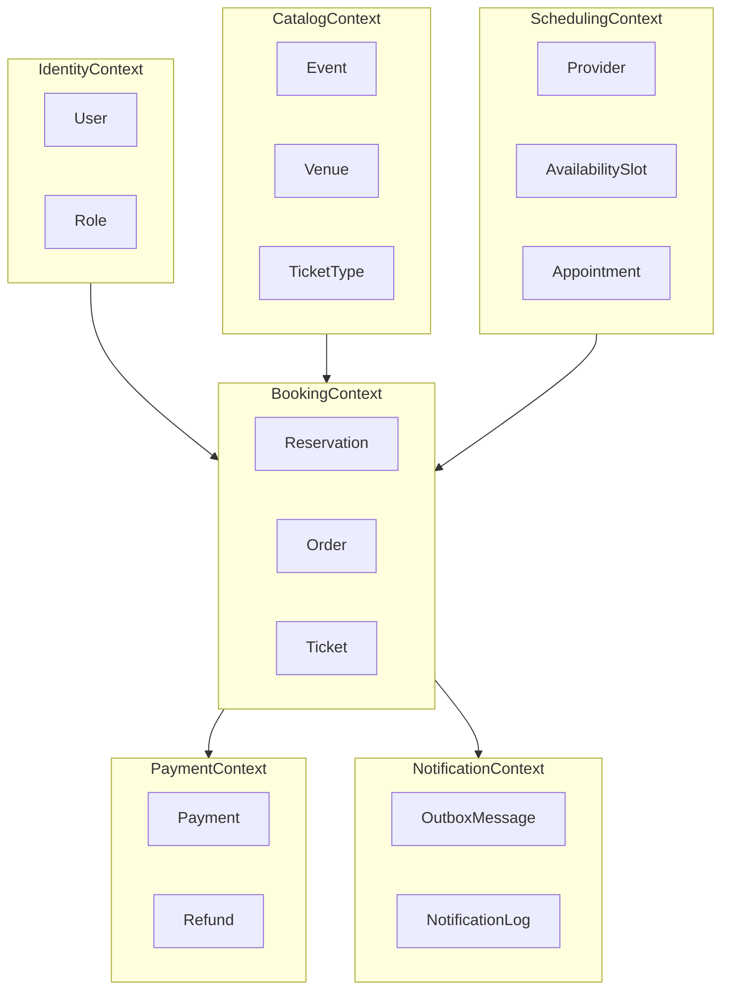
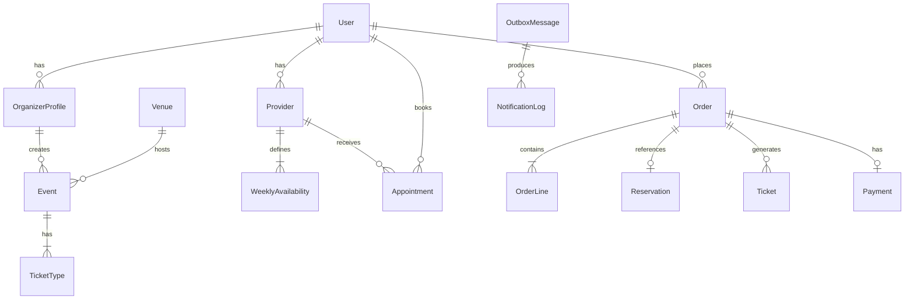

# ReserveFlow — Domain Modeli

## Bounded Context Haritası



## Context Sorumlulukları

| Context | Sorumluluk | Aggregate Root'lar |
|---------|------------|-------------------|
| **Identity** | Kimlik doğrulama, rol yönetimi | `User` |
| **Catalog** | Etkinlik vitrini, bilet tipi tanımı | `Event`, `OrganizerProfile` |
| **Scheduling** | Randevu takvimi, müsaitlik | `Provider`, `Appointment` |
| **Booking** | Rezervasyon iş kuralları, sipariş | `Order`, `Reservation` |
| **Payment** | Tahsilat ve iade | `Payment` |
| **Notification** | Async bildirim | `OutboxMessage` |

---

## Identity Context

### User (Aggregate Root)

```text
User
├── Id: UserId (UUID)
├── Email: Email (value object)
├── PasswordHash: string
├── Status: Active | Suspended | Deleted
├── Roles: Role[]
└── CreatedAt: DateTime
```

**İş kuralları:**
- Email benzersiz olmalı
- Şifre hash'lenmiş saklanmalı (plain text yok)
- Suspended kullanıcı giriş yapamaz

### Role (Entity)

```text
Role
├── Id: RoleId
├── Name: Customer | Organizer | Provider | Admin
└── Permissions: Permission[]
```

---

## Catalog Context

### OrganizerProfile (Aggregate Root)

```text
OrganizerProfile
├── Id: OrganizerId
├── UserId: UserId (Identity context referansı)
├── DisplayName: string
├── Bio: string?
└── Events: EventId[] (sadece ID referansı)
```

### Venue (Entity)

```text
Venue
├── Id: VenueId
├── Name: string
├── Address: Address (value object)
├── Capacity: int
└── TimeZone: string
```

### Event (Aggregate Root)

```text
Event
├── Id: EventId
├── OrganizerId: OrganizerId
├── VenueId: VenueId
├── Title: string
├── Description: string
├── StartAt: DateTime
├── EndAt: DateTime
├── Status: Draft | Published | Cancelled | Completed
├── TicketTypes: TicketType[]
└── PublishedAt: DateTime?
```

**İş kuralları:**
- Sadece `Draft` durumdaki etkinlik düzenlenebilir
- `Published` olmak için en az 1 aktif TicketType gerekli
- StartAt < EndAt olmalı
- Geçmiş tarihli etkinlik publish edilemez

### TicketType (Entity — Event aggregate içinde)

```text
TicketType
├── Id: TicketTypeId
├── Name: string
├── Price: Money (value object)
├── Quota: int
├── SoldCount: int
├── SalesStartAt: DateTime
├── SalesEndAt: DateTime
└── IsActive: bool
```

**İş kuralları:**
- `SoldCount <= Quota` her zaman
- Satış penceresi dışında bilet satılamaz
- Quota 0'a indiğinde satış durur

**Domain Events:**
- `EventPublished`
- `EventCancelled`
- `TicketTypeSoldOut`

---

## Scheduling Context

### Provider (Aggregate Root)

```text
Provider
├── Id: ProviderId
├── UserId: UserId
├── DisplayName: string
├── Specialty: string
├── DefaultDurationMinutes: int
├── WeeklyAvailability: WeeklyAvailability[]
└── Status: Active | Inactive
```

### WeeklyAvailability (Entity)

```text
WeeklyAvailability
├── DayOfWeek: DayOfWeek
├── StartTime: TimeOnly
├── EndTime: TimeOnly
└── IsActive: bool
```

### TimeSlot (Entity — hesaplanan veya persist edilen)

```text
TimeSlot
├── Id: TimeSlotId
├── ProviderId: ProviderId
├── StartAt: DateTime
├── EndAt: DateTime
├── Status: Available | Booked | Blocked
└── AppointmentId: AppointmentId?
```

### Appointment (Aggregate Root)

```text
Appointment
├── Id: AppointmentId
├── ProviderId: ProviderId
├── CustomerId: UserId
├── TimeSlotId: TimeSlotId
├── StartAt: DateTime
├── EndAt: DateTime
├── Status: Pending | Confirmed | Cancelled | Completed | NoShow
├── Notes: string?
└── CancelledAt: DateTime?
```

**İş kuralları:**
- Aynı provider için overlapping slot rezerve edilemez
- İptal: etkinlikten 24 saat öncesine kadar (policy value object)
- Sadece `Confirmed` randevu tamamlanabilir

**Domain Events:**
- `AppointmentBooked`
- `AppointmentCancelled`
- `AppointmentCompleted`

---

## Booking Context

### Reservation (Aggregate Root)

```text
Reservation
├── Id: ReservationId
├── Type: Event | Appointment
├── ReferenceId: EventId | AppointmentId
├── CustomerId: UserId
├── Status: Pending | Confirmed | Cancelled | Expired
├── ExpiresAt: DateTime
└── OrderId: OrderId?
```

**İş kuralları:**
- Pending rezervasyon `ExpiresAt` sonrası otomatik expire olur
- Confirm ancak ödeme başarılı olduktan sonra

### Order (Aggregate Root)

```text
Order
├── Id: OrderId
├── CustomerId: UserId
├── ReservationId: ReservationId
├── Lines: OrderLine[]
├── TotalAmount: Money
├── Status: Pending | Confirmed | Cancelled | Expired
├── IdempotencyKey: string
├── CreatedAt: DateTime
└── ConfirmedAt: DateTime?
```

### OrderLine (Entity)

```text
OrderLine
├── Id: OrderLineId
├── ItemType: TicketType | Appointment
├── ItemId: TicketTypeId | AppointmentId
├── Quantity: int
├── UnitPrice: Money
└── LineTotal: Money
```

### Ticket (Entity — Order confirm sonrası)

```text
Ticket
├── Id: TicketId
├── OrderId: OrderId
├── EventId: EventId
├── TicketTypeId: TicketTypeId
├── TicketCode: string (unique, QR için)
├── HolderName: string
└── IssuedAt: DateTime
```

**İş kuralları:**
- Aynı `IdempotencyKey` ile gelen istek aynı sonucu döner
- Order confirm → Ticket issue (event) veya Appointment confirm (appointment)
- Çift satış: optimistic concurrency veya DB unique constraint ile engellenir

**Domain Events:**
- `OrderCreated`
- `OrderConfirmed`
- `OrderExpired`
- `OrderCancelled`
- `TicketIssued`

---

## Payment Context

### Payment (Aggregate Root)

```text
Payment
├── Id: PaymentId
├── OrderId: OrderId
├── Amount: Money
├── Status: Pending | Completed | Failed | Refunded
├── IdempotencyKey: string
├── GatewayReference: string?
├── FailureReason: string?
├── CreatedAt: DateTime
└── CompletedAt: DateTime?
```

**İş kuralları:**
- Fake gateway: configurable success/failure/timeout
- Payment timeout → Order `Expired`
- Başarılı payment → `OrderConfirmed` event

**Domain Events:**
- `PaymentCompleted`
- `PaymentFailed`

### Refund (Entity — MVP+)

```text
Refund
├── Id: RefundId
├── PaymentId: PaymentId
├── Amount: Money
├── Reason: string
└── Status: Pending | Completed | Failed
```

---

## Notification Context

### OutboxMessage (Aggregate Root)

```text
OutboxMessage
├── Id: OutboxId
├── EventType: string
├── Payload: JSON
├── Status: Pending | Processing | Sent | Failed
├── RetryCount: int
├── CreatedAt: DateTime
├── ProcessedAt: DateTime?
└── NextRetryAt: DateTime?
```

### NotificationLog (Entity)

```text
NotificationLog
├── Id: NotificationId
├── OutboxId: OutboxId
├── Channel: Email | SMS
├── Recipient: string
├── Subject: string
├── Body: string
├── Status: Sent | Failed
└── SentAt: DateTime?
```

---

## Shared Kernel (Value Objects)

```text
Money
├── Amount: decimal
└── Currency: string (default: TRY)

Email
└── Value: string (validated)

Address
├── Street: string
├── City: string
├── Country: string
└── PostalCode: string?

DateRange
├── Start: DateTime
└── End: DateTime
```

---

## Context'ler Arası İletişim

### Domain Events (async)

| Event | Publisher | Consumer |
|-------|-----------|----------|
| `OrderConfirmed` | Booking | Notification, Catalog (SoldCount++) |
| `OrderExpired` | Booking | Catalog (quota release), Scheduling |
| `PaymentCompleted` | Payment | Booking |
| `PaymentFailed` | Payment | Booking |
| `AppointmentBooked` | Scheduling | Notification |
| `TicketIssued` | Booking | Notification |

### Anti-Corruption Layer

- **Payment:** `IPaymentGateway` port → `FakePaymentGateway` adapter
- **Notification:** `INotificationSender` port → `LoggingNotificationSender` adapter
- **Identity:** JWT claims → application layer DTO (UserId, Roles)

---

## DDD Kuralları

1. Her aggregate tek repository üzerinden değişir.
2. Aggregate dışına sadece ID referansı çıkar; entity referansı taşınmaz.
3. Application service ince kalır; iş kuralı domain entity/value object içindedir.
4. Cross-context işlemler domain event veya orchestration saga ile yapılır.
5. Infrastructure concern'ler (EF Core, Redis, HTTP) domain katmanına girmez.

---

## ER Diyagramı (Özet)


