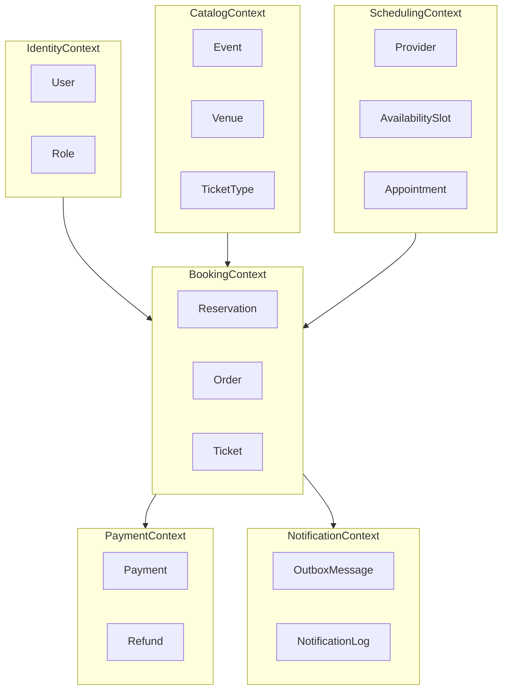
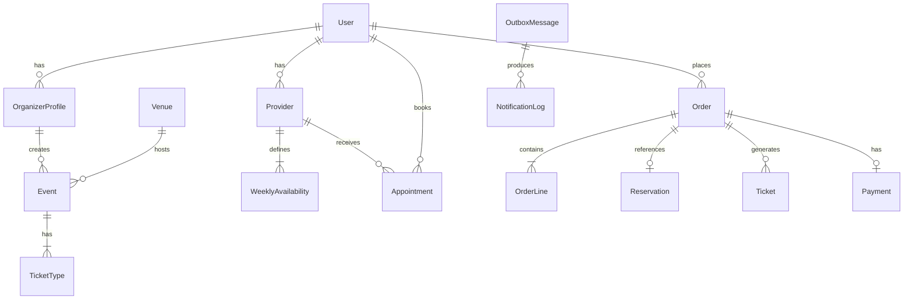

# ReserveFlow — Domain Model

## Bounded Context Map



## Context Responsibilities

| Context | Responsibility | Aggregate Roots |
|---------|------------|-------------------|
| **Identity** | Authentication, role management | `User` |
| **Catalog** | Event catalog, ticket type definition | `Event`, `OrganizerProfile` |
| **Scheduling** | Appointment scheduling, availability | `Provider`, `Appointment` |
| **Booking** | Reservation business rules, orders | `Order`, `Reservation` |
| **Payment** | Payment collection and refunds | `Payment` |
| **Notification** | Asynchronous notifications | `OutboxMessage` |

---

## Identity Context

### User (Aggregate Root)

```text
User
├── Id: UserId (UUID)
├── Email: Email (value object)
├── PasswordHash: string
├── Status: Active | Suspended | Deleted
├── Roles: Role[]
└── CreatedAt: DateTime
```

**Business rules:**
- Email must be unique
- Passwords must be stored as hashes (no plaintext)
- Suspended users cannot sign in

### Role (Entity)

```text
Role
├── Id: RoleId
├── Name: Customer | Organizer | Provider | Admin
└── Permissions: Permission[]
```

---

## Catalog Context

### OrganizerProfile (Aggregate Root)

```text
OrganizerProfile
├── Id: OrganizerId
├── UserId: UserId (Identity context reference)
├── DisplayName: string
├── Bio: string?
└── Events: EventId[] (ID references only)
```

### Venue (Entity)

```text
Venue
├── Id: VenueId
├── Name: string
├── Address: Address (value object)
├── Capacity: int
└── TimeZone: string
```

### Event (Aggregate Root)

```text
Event
├── Id: EventId
├── OrganizerId: OrganizerId
├── VenueId: VenueId
├── Title: string
├── Description: string
├── StartAt: DateTime
├── EndAt: DateTime
├── Status: Draft | Published | Cancelled | Completed
├── TicketTypes: TicketType[]
└── PublishedAt: DateTime?
```

**Business rules:**
- Only events in `Draft` status can be edited
- At least one active TicketType is required for an event to become `Published`
- StartAt must be earlier than EndAt
- An event with a past date cannot be published

### TicketType (Entity — within the Event aggregate)

```text
TicketType
├── Id: TicketTypeId
├── Name: string
├── Price: Money (value object)
├── Quota: int
├── SoldCount: int
├── SalesStartAt: DateTime
├── SalesEndAt: DateTime
└── IsActive: bool
```

**Business rules:**
- `SoldCount <= Quota` at all times
- Tickets cannot be sold outside the sales window
- Sales stop when Quota reaches 0

**Domain Events:**
- `EventPublished`
- `EventCancelled`
- `TicketTypeSoldOut`

---

## Scheduling Context

### Provider (Aggregate Root)

```text
Provider
├── Id: ProviderId
├── UserId: UserId
├── DisplayName: string
├── Specialty: string
├── DefaultDurationMinutes: int
├── WeeklyAvailability: WeeklyAvailability[]
└── Status: Active | Inactive
```

### WeeklyAvailability (Entity)

```text
WeeklyAvailability
├── DayOfWeek: DayOfWeek
├── StartTime: TimeOnly
├── EndTime: TimeOnly
└── IsActive: bool
```

### TimeSlot (Entity — computed or persisted)

```text
TimeSlot
├── Id: TimeSlotId
├── ProviderId: ProviderId
├── StartAt: DateTime
├── EndAt: DateTime
├── Status: Available | Booked | Blocked
└── AppointmentId: AppointmentId?
```

### Appointment (Aggregate Root)

```text
Appointment
├── Id: AppointmentId
├── ProviderId: ProviderId
├── CustomerId: UserId
├── TimeSlotId: TimeSlotId
├── StartAt: DateTime
├── EndAt: DateTime
├── Status: Pending | Confirmed | Cancelled | Completed | NoShow
├── Notes: string?
└── CancelledAt: DateTime?
```

**Business rules:**
- Overlapping slots cannot be booked for the same provider
- Cancellation: permitted up to 24 hours before the event (policy value object)
- Only a `Confirmed` appointment can be completed

**Domain Events:**
- `AppointmentBooked`
- `AppointmentCancelled`
- `AppointmentCompleted`

---

## Booking Context

### Reservation (Aggregate Root)

```text
Reservation
├── Id: ReservationId
├── Type: Event | Appointment
├── ReferenceId: EventId | AppointmentId
├── CustomerId: UserId
├── Status: Pending | Confirmed | Cancelled | Expired
├── ExpiresAt: DateTime
└── OrderId: OrderId?
```

**Business rules:**
- A Pending reservation automatically expires after `ExpiresAt`
- Confirmation occurs only after a successful payment

### Order (Aggregate Root)

```text
Order
├── Id: OrderId
├── CustomerId: UserId
├── ReservationId: ReservationId
├── Lines: OrderLine[]
├── TotalAmount: Money
├── Status: Pending | Confirmed | Cancelled | Expired
├── IdempotencyKey: string
├── CreatedAt: DateTime
└── ConfirmedAt: DateTime?
```

### OrderLine (Entity)

```text
OrderLine
├── Id: OrderLineId
├── ItemType: TicketType | Appointment
├── ItemId: TicketTypeId | AppointmentId
├── Quantity: int
├── UnitPrice: Money
└── LineTotal: Money
```

### Ticket (Entity — after Order confirmation)

```text
Ticket
├── Id: TicketId
├── OrderId: OrderId
├── EventId: EventId
├── TicketTypeId: TicketTypeId
├── TicketCode: string (unique, for QR)
├── HolderName: string
└── IssuedAt: DateTime
```

**Business rules:**
- A request with the same `IdempotencyKey` returns the same result
- Order confirmation → Ticket issuance (event) or Appointment confirmation (appointment)
- Double-selling is prevented through optimistic concurrency or a database unique constraint

**Domain Events:**
- `OrderCreated`
- `OrderConfirmed`
- `OrderExpired`
- `OrderCancelled`
- `TicketIssued`

---

## Payment Context

### Payment (Aggregate Root)

```text
Payment
├── Id: PaymentId
├── OrderId: OrderId
├── Amount: Money
├── Status: Pending | Completed | Failed | Refunded
├── IdempotencyKey: string
├── GatewayReference: string?
├── FailureReason: string?
├── CreatedAt: DateTime
└── CompletedAt: DateTime?
```

**Business rules:**
- Fake gateway: configurable success/failure/timeout
- Payment timeout → Order `Expired`
- Successful payment → `OrderConfirmed` event

**Domain Events:**
- `PaymentCompleted`
- `PaymentFailed`

### Refund (Entity — MVP+)

```text
Refund
├── Id: RefundId
├── PaymentId: PaymentId
├── Amount: Money
├── Reason: string
└── Status: Pending | Completed | Failed
```

---

## Notification Context

### OutboxMessage (Aggregate Root)

```text
OutboxMessage
├── Id: OutboxId
├── EventType: string
├── Payload: JSON
├── Status: Pending | Processing | Sent | Failed
├── RetryCount: int
├── CreatedAt: DateTime
├── ProcessedAt: DateTime?
└── NextRetryAt: DateTime?
```

### NotificationLog (Entity)

```text
NotificationLog
├── Id: NotificationId
├── OutboxId: OutboxId
├── Channel: Email | SMS
├── Recipient: string
├── Subject: string
├── Body: string
├── Status: Sent | Failed
└── SentAt: DateTime?
```

---

## Shared Kernel (Value Objects)

```text
Money
├── Amount: decimal
└── Currency: string (default: TRY)

Email
└── Value: string (validated)

Address
├── Street: string
├── City: string
├── Country: string
└── PostalCode: string?

DateRange
├── Start: DateTime
└── End: DateTime
```

---

## Inter-Context Communication

### Domain Events (async)

| Event | Publisher | Consumer |
|-------|-----------|----------|
| `OrderConfirmed` | Booking | Notification, Catalog (SoldCount++) |
| `OrderExpired` | Booking | Catalog (quota release), Scheduling |
| `PaymentCompleted` | Payment | Booking |
| `PaymentFailed` | Payment | Booking |
| `AppointmentBooked` | Scheduling | Notification |
| `TicketIssued` | Booking | Notification |

### Anti-Corruption Layer

- **Payment:** `IPaymentGateway` port → `FakePaymentGateway` adapter
- **Notification:** `INotificationSender` port → `LoggingNotificationSender` adapter
- **Identity:** JWT claims → application layer DTO (UserId, Roles)

---

## DDD Rules

1. Each aggregate is modified through a single repository.
2. Only ID references cross aggregate boundaries; entity references are not passed.
3. Application services remain thin; business rules reside in domain entities/value objects.
4. Cross-context operations are performed through domain events or orchestration sagas.
5. Infrastructure concerns (EF Core, Redis, HTTP) do not enter the domain layer.

---

## ER Diagram (Summary)


