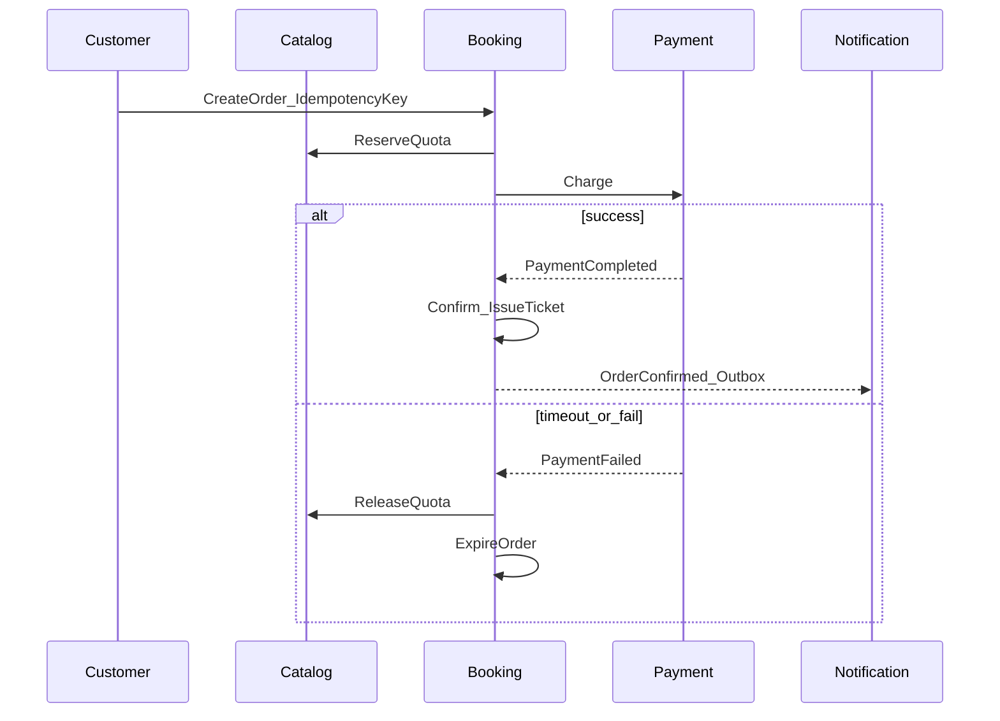
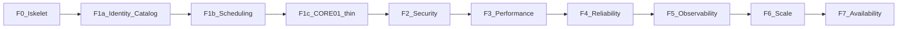

# ReserveFlow — Use Case Kataloğu

Use case'ler **ürün backlog'u değil**, mimari laboratuvar deneyi listesidir.

**Ekleme kuralı:** Yeni use case ancak (1) bir bounded context sınırını veya aggregate kuralını egzersizliyorsa ve (2) `docs/NFR.md` içindeki bir NFR'yi doğrulayacaksa eklenir — `docs/PROJECT.md` scope guardrail ile aynı.

Application katmanında her use case ≈ bir command/query handler (ör. `CreateReservation`). Bu katalog klasör/handler isimlendirmesinin kaynağıdır.

İlgili dokümanlar: [PROJECT.md](PROJECT.md) · [DOMAIN.md](DOMAIN.md) · [NFR.md](NFR.md) · [STRUCTURE.md](STRUCTURE.md)

---

## Aktörler

| Aktör | Rol |
|-------|-----|
| Customer | Bilet alır, randevu alır |
| Organizer | Etkinlik / TicketType yönetir |
| Provider | Müsaitlik ve randevu yönetir |
| Admin | Liste + doluluk raporu |
| System | Expire, outbox, retry (background) |

---

## Şablon

Her use case aşağıdaki alanlarla tanımlanır:

| Alan | Açıklama |
|------|----------|
| **ID** | Benzersiz kimlik (`UC-*`) |
| **Aktör** | Tetikleyen rol |
| **Özet** | Tek cümle |
| **Ana akış** | 3–7 adım |
| **Domain** | Kurallar / domain event'ler |
| **NFR** | Hedef NFR ID'leri |
| **Faz** | F1–F7 |

---

## Kritik dikey dilimler (önce bunlar)

Laboratuvarın omurga senaryoları — tek tek CRUD değil, context geçişli akışlar.

### UC-CORE-01 — Etkinlik bileti satışı (happy path)

| Alan | Değer |
|------|-------|
| **Aktör** | Customer |
| **Özet** | Publish edilmiş Event + TicketType için sipariş verilir; ödeme başarılı olunca bilet üretilir ve bildirim kuyruğa alınır. |
| **Ana akış** | 1. Customer publish Event ve aktif TicketType seçer. 2. `Order` + `Reservation` oluşturulur (`IdempotencyKey`). 3. Catalog'da kota rezerve edilir (`SoldCount++` veya hold). 4. Fake payment success. 5. Order `Confirmed` → `Ticket` issue. 6. `OrderConfirmed` / `TicketIssued` outbox'a yazılır. |
| **Domain** | Catalog ↔ Booking ↔ Payment ↔ Notification sınırları; event'ler: `OrderCreated`, `PaymentCompleted`, `OrderConfirmed`, `TicketIssued`. |
| **NFR** | NFR-M02, NFR-R02, NFR-R04, NFR-O02 |
| **Faz** | F1 (domain), F4 (idempotency/outbox), F5 (trace) |

### UC-CORE-02 — Randevu rezervasyonu (happy path)

| Alan | Değer |
|------|-------|
| **Aktör** | Customer |
| **Özet** | Provider müsait slot'undan randevu alınır; ödeme sonrası Appointment confirm olur. |
| **Ana akış** | 1. Customer Provider ve müsait slot seçer. 2. Scheduling'de `Appointment` (Pending) + Booking'de Order/Reservation. 3. Fake payment success. 4. Appointment `Confirmed`; bildirim outbox. |
| **Domain** | Scheduling overlap kuralı; Booking orchestration; event'ler: `AppointmentBooked`, `OrderConfirmed`. |
| **NFR** | NFR-R01, NFR-P01, NFR-R04 |
| **Faz** | F1, F3 (slot liste), F4 |

### UC-CORE-03 — Çift satış / overlap yarışı

| Alan | Değer |
|------|-------|
| **Aktör** | Customer (eşzamanlı) |
| **Özet** | Aynı TicketType kontenjanına veya aynı TimeSlot'a iki eşzamanlı istek; yalnızca biri kazanır. |
| **Ana akış** | 1. İki istek aynı anda Order/Appointment oluşturmayı dener. 2. Optimistic concurrency veya unique constraint birini reddeder. 3. Kaybeden istek anlamlı hata alır; kota/slot tutarlı kalır. |
| **Domain** | Aggregate tutarlılığı; `SoldCount <= Quota`; provider overlap yok. |
| **NFR** | NFR-R01 |
| **Faz** | F4 |

### UC-CORE-04 — Idempotent yeniden deneme

| Alan | Değer |
|------|-------|
| **Aktör** | Customer / client retry |
| **Özet** | Aynı `IdempotencyKey` ile Order veya Payment tekrarı aynı sonucu döner; yan etki yok. |
| **Ana akış** | 1. İlk istek Order oluşturur. 2. Aynı key ile ikinci istek gelir. 3. Mevcut Order/Payment döner; ek kota düşümü veya ikinci charge yok. |
| **Domain** | `Order.IdempotencyKey`, `Payment.IdempotencyKey` unique. |
| **NFR** | NFR-R02 |
| **Faz** | F4 |

### UC-CORE-05 — Ödeme timeout / fail → expire → kota/slot serbest

| Alan | Değer |
|------|-------|
| **Aktör** | System (+ Customer tetikleyen ödeme) |
| **Özet** | Fake gateway fail veya timeout sonrası Order expire olur; Catalog kota veya Scheduling slot serbest bırakılır. |
| **Ana akış** | 1. Payment fail/timeout. 2. `PaymentFailed` → Booking Order `Expired`/`Cancelled`. 3. Catalog SoldCount geri alınır veya Scheduling slot Available olur. 4. Gerekirse outbox bildirim. |
| **Domain** | Event zinciri / basit saga: `PaymentFailed`, `OrderExpired`; consumer: Catalog, Scheduling. |
| **NFR** | NFR-R03, NFR-R05, NFR-R04 |
| **Faz** | F4 |

---

## Identity

### UC-ID-01 — Kayıt (Customer)

| Alan | Değer |
|------|-------|
| **Aktör** | Customer (anonim) |
| **Özet** | E-posta + şifre ile kullanıcı kaydı. |
| **Ana akış** | 1. Register isteği validate edilir. 2. Email benzersiz kontrolü. 3. Şifre hash'lenir; User `Active` + rol `Customer`. |
| **Domain** | Email VO; plain text şifre yok. |
| **NFR** | NFR-S01, NFR-S04, NFR-S05 |
| **Faz** | F2 |

### UC-ID-02 — Giriş → JWT

| Alan | Değer |
|------|-------|
| **Aktör** | Customer / Organizer / Provider / Admin |
| **Özet** | Kimlik doğrulama sonrası JWT access token. |
| **Ana akış** | 1. Email/şifre doğrulanır. 2. Suspended kullanıcı reddedilir. 3. JWT (süre ≤ 60 dk) + role claims. |
| **Domain** | User status; Role claims. |
| **NFR** | NFR-S01 |
| **Faz** | F2 |

### UC-ID-03 — Rol ile endpoint erişimi (RBAC)

| Alan | Değer |
|------|-------|
| **Aktör** | Organizer, Customer, Admin |
| **Özet** | Organizer event oluşturabilir; Customer başkasının siparişini göremez. |
| **Ana akış** | 1. Protected endpoint JWT ister. 2. Policy/role kontrolü. 3. Yetkisiz → 403; başkasının kaynağı → 403. |
| **Domain** | Identity claims → application DTO (ACL). |
| **NFR** | NFR-S02 |
| **Faz** | F2 |

### UC-ID-04 — Rate limit aşımı → 429

| Alan | Değer |
|------|-------|
| **Aktör** | Anonim / Customer |
| **Özet** | Public endpoint 100 req/dk/IP; booking 10 req/dk/user aşıldığında 429. |
| **Ana akış** | 1. Limit içinde istekler 2xx/4xx normal. 2. Limit aşımı → 429. |
| **Domain** | — (infrastructure middleware). |
| **NFR** | NFR-S03 |
| **Faz** | F2 |

---

## Catalog

### UC-CAT-01 — Organizer profil oluştur

| Alan | Değer |
|------|-------|
| **Aktör** | Organizer |
| **Özet** | Kimliği olan kullanıcı OrganizerProfile oluşturur. |
| **Ana akış** | 1. Authenticated User. 2. DisplayName (+ opsiyonel Bio). 3. `OrganizerProfile` aggregate persist. |
| **Domain** | UserId Identity referansı (ID only). |
| **NFR** | NFR-M01, NFR-M02 |
| **Faz** | F1 |

### UC-CAT-02 — Event oluştur (Draft) + TicketType ekle

| Alan | Değer |
|------|-------|
| **Aktör** | Organizer |
| **Özet** | Draft Event ve en az bir TicketType (fiyat, kota, satış penceresi). |
| **Ana akış** | 1. Venue + başlık + StartAt/EndAt. 2. Status `Draft`. 3. TicketType ekle (Quota, Price, SalesStart/End). |
| **Domain** | StartAt < EndAt; TicketType Event aggregate içinde. |
| **NFR** | NFR-M02, NFR-S04 |
| **Faz** | F1 |

### UC-CAT-03 — Event publish

| Alan | Değer |
|------|-------|
| **Aktör** | Organizer |
| **Özet** | Draft Event'i yayınlar; satışa açar. |
| **Ana akış** | 1. En az 1 aktif TicketType kontrolü. 2. Geçmiş tarih engeli. 3. Status `Published`; `EventPublished`. |
| **Domain** | Sadece Draft düzenlenebilir; publish kuralları. |
| **NFR** | NFR-M02 |
| **Faz** | F1 |

### UC-CAT-04 — Event listele (pagination + cache)

| Alan | Değer |
|------|-------|
| **Aktör** | Customer / anonim (policy'ye göre) |
| **Özet** | Publish Event listesi; sayfalama ve Redis cache. |
| **Ana akış** | 1. page/pageSize ile sorgu. 2. Cache hit/miss. 3. p95 hedefi altında yanıt. |
| **Domain** | Read model; Published filtre. |
| **NFR** | NFR-P01, NFR-P02, NFR-P03 |
| **Faz** | F3 |

### UC-CAT-05 — Event iptal

| Alan | Değer |
|------|-------|
| **Aktör** | Organizer |
| **Özet** | Event iptal edilir; ilgili pending rezervasyonlar iptal yoluna girer. |
| **Ana akış** | 1. Event `Cancelled`; `EventCancelled`. 2. Booking pending Order/Reservation iptal/expire. 3. Bildirim outbox (opsiyonel). |
| **Domain** | Cross-context event; kota/slot serbest bırakma. |
| **NFR** | NFR-R04, NFR-O04 |
| **Faz** | F4 |

---

## Scheduling

### UC-SCH-01 — Provider profil + haftalık müsaitlik

| Alan | Değer |
|------|-------|
| **Aktör** | Provider |
| **Özet** | Provider profili ve WeeklyAvailability tanımı. |
| **Ana akış** | 1. DisplayName, Specialty, DefaultDurationMinutes. 2. Gün/saat aralıkları. 3. Status `Active`. |
| **Domain** | Provider aggregate; WeeklyAvailability entity. |
| **NFR** | NFR-M02 |
| **Faz** | F1 |

### UC-SCH-02 — Müsait slot listele

| Alan | Değer |
|------|-------|
| **Aktör** | Customer |
| **Özet** | Provider için Available TimeSlot listesi. |
| **Ana akış** | 1. ProviderId + tarih aralığı. 2. Availability'den slot üret/oku. 3. Booked/Blocked hariç döner. |
| **Domain** | TimeSlot status. |
| **NFR** | NFR-P01, NFR-P02 |
| **Faz** | F3 |

### UC-SCH-03 — Appointment oluştur (overlap engeli)

| Alan | Değer |
|------|-------|
| **Aktör** | Customer |
| **Özet** | Seçilen slot için Appointment; aynı provider'da overlap yasak. |
| **Ana akış** | 1. Slot Available mı kontrol. 2. Appointment Pending. 3. Overlap varsa reddet. |
| **Domain** | Overlap kuralı; `AppointmentBooked`. |
| **NFR** | NFR-R01, NFR-M02 |
| **Faz** | F1, F4 |

### UC-SCH-04 — İptal / yeniden planlama

| Alan | Değer |
|------|-------|
| **Aktör** | Customer / Provider |
| **Özet** | 24 saat kuralı ile iptal; basit yeniden planlama. |
| **Ana akış** | 1. İptal isteği → 24 saat policy. 2. Status `Cancelled`; slot serbest. 3. Yeniden planlama: eski iptal + yeni slot (basit). |
| **Domain** | Cancel policy VO; `AppointmentCancelled`. |
| **NFR** | NFR-M02, NFR-R01 |
| **Faz** | F1 |

---

## Booking + Payment + Notification

CORE-01…05 omurga; aşağıdaki use case'ler tamamlayıcıdır.

### UC-BOOK-06 — Pending rezervasyon expire (System)

| Alan | Değer |
|------|-------|
| **Aktör** | System |
| **Özet** | `ExpiresAt` geçmiş Pending Reservation/Order otomatik expire. |
| **Ana akış** | 1. Background job adayları tarar. 2. Status `Expired`; `OrderExpired`. 3. Catalog/Scheduling release. |
| **Domain** | Reservation ExpiresAt; event consumer'lar. |
| **NFR** | NFR-R03 |
| **Faz** | F4 |

### UC-PAY-01 — Fake gateway senaryoları

| Alan | Değer |
|------|-------|
| **Aktör** | Customer (Payment üzerinden) |
| **Özet** | `IPaymentGateway` fake adapter: success / fail / timeout. |
| **Ana akış** | 1. Charge çağrısı. 2. Konfigüre senaryoya göre Completed / Failed / timeout. 3. Booking event ile tepki verir (CORE-01 veya CORE-05). |
| **Domain** | ACL: port/adapter; `PaymentCompleted` / `PaymentFailed`. |
| **NFR** | NFR-R05, NFR-SC03 (ileride) |
| **Faz** | F4 |

### UC-NOTIF-01 — Outbox gönderim ve retry

| Alan | Değer |
|------|-------|
| **Aktör** | System |
| **Özet** | OutboxMessage Pending → Processing → Sent; fail'de retry. |
| **Ana akış** | 1. Domain event ile outbox satırı. 2. Worker işler → LoggingNotificationSender. 3. Fail → RetryCount++, NextRetryAt. |
| **Domain** | OutboxMessage aggregate; NotificationLog. |
| **NFR** | NFR-R04 |
| **Faz** | F4 |

---

## Admin

### UC-ADM-01 — Etkinlik / randevu listele

| Alan | Değer |
|------|-------|
| **Aktör** | Admin |
| **Özet** | Admin paneli için Event ve Appointment listeleri. |
| **Ana akış** | 1. JWT + Admin rolü. 2. Filtreli/paginated liste. |
| **Domain** | Cross-context read (ID + DTO); yazma yok. |
| **NFR** | NFR-S02, NFR-P02 |
| **Faz** | F2, F3 |

### UC-ADM-02 — Satış adedi + doluluk oranı

| Alan | Değer |
|------|-------|
| **Aktör** | Admin |
| **Özet** | Basit rapor: satış adedi, doluluk. |
| **Ana akış** | 1. Event/TicketType veya Provider için aggregate query. 2. SoldCount/Quota veya booked/available oranı. |
| **Domain** | Read-only projection; karmaşık BI yok. |
| **NFR** | NFR-P01, NFR-A02 (sağlık yanında okuma yolu) |
| **Faz** | F3, F7 |

---

## Uygulama sırası (aşamalar)

Sıra bağımlılığa göre sabitlenmiştir: önce domain iskeleti ve tek dikey dilim (event bileti), sonra güvenlik, performans, güvenilirlik, gözlemlenebilirlik.

### F0 — Solution iskeleti (use case yok)

| Sıra | İş | Çıktı / kanıt |
|------|-----|----------------|
| 0.1 | 4 katman + `Shared` (Entity, AggregateRoot, VO, IDomainEvent) | Derlenen solution |
| 0.2 | EF Core + PostgreSQL DbContext (boş/minimal) | Migration çalışır |
| 0.3 | NetArchTest katman kuralları | NFR-M01 |

**Bitiş kapısı:** Architecture test yeşil; Infrastructure → Domain bağımlılığı yok.

---

### F1a — Identity + Catalog (yazma yolu)

| Sıra | Use case | Not |
|------|----------|-----|
| 1 | **UC-ID-01** Kayıt | JWT zorunlu değil; User aggregate + hash |
| 2 | **UC-ID-02** Giriş (basit token veya dev stub) | Tam JWT sertleştirme F2'de |
| 3 | **UC-CAT-01** Organizer profil | UserId referansı |
| 4 | **UC-CAT-02** Event Draft + TicketType | Venue dahil |
| 5 | **UC-CAT-03** Publish | Domain kuralları + unit test |

**Bitiş kapısı:** Organizer publish edilmiş Event üretebiliyor; NFR-M02 domain testleri.

---

### F1b — Scheduling (yazma yolu)

| Sıra | Use case | Not |
|------|----------|-----|
| 6 | **UC-SCH-01** Provider + haftalık müsaitlik | |
| 7 | **UC-SCH-03** Appointment oluştur (overlap) | Domain + unit; API ince |
| 8 | **UC-SCH-04** İptal / yeniden planlama | 24 saat policy |

**Bitiş kapısı:** Overlap reddi unit test ile kanıtlı.

---

### F1c — İlk dikey dilim (UC-CORE-01 ince)

Happy path senkron ve sade: outbox/concurrency yok; fake payment yalnız **success**.

| Sıra | Use case | Not |
|------|----------|-----|
| 9 | Order + Reservation oluştur (CORE-01 adım 1–3) | Kota hold/SoldCount |
| 10 | **UC-PAY-01** yalnızca success | Port + FakePaymentGateway |
| 11 | Confirm + Ticket issue (CORE-01 adım 5) | `TicketIssued` domain event (in-process) |
| 12 | **UC-CORE-02** ince dilim | SCH-03 + aynı Order/Payment yolu |

**Bitiş kapısı:** Event bileti ve randevu uçtan uca (success only) çalışır; F1 kapanır.

---

### F2 — Security

Mevcut endpoint'ler üzerine kilit; yeni iş kuralı yok.

| Sıra | Use case | Not |
|------|----------|-----|
| 13 | **UC-ID-02** JWT Bearer (≤ 60 dk) | NFR-S01 |
| 14 | **UC-ID-03** RBAC | Organizer create; Customer isolation |
| 15 | FluentValidation tüm public command'larda | NFR-S04 |
| 16 | **UC-ID-04** Rate limit | public + booking |
| 17 | **UC-ADM-01** liste (RBAC ile) | Admin only |

**Bitiş kapısı:** 401 / 403 / 429 integration testleri yeşil.

---

### F3 — Performance (okuma yolları)

| Sıra | Use case | Not |
|------|----------|-----|
| 18 | **UC-CAT-04** Event listele | pagination + Redis + index |
| 19 | **UC-SCH-02** Müsait slot listele | p95 ölçümü |
| 20 | **UC-ADM-02** doluluk raporu | basit aggregate query |

**Bitiş kapısı:** Liste endpoint'lerinde p95 < 300 ms kanıtı (NFR-P01/P02/P03).

---

### F4 — Reliability (omurga sertleştirme)

| Sıra | Use case | Not |
|------|----------|-----|
| 21 | **UC-CORE-04** Idempotency | Order + Payment key |
| 22 | **UC-CORE-03** Çift satış / overlap yarışı | concurrency test |
| 23 | **UC-PAY-01** fail + timeout | |
| 24 | **UC-CORE-05** expire + kota/slot release | event zinciri |
| 25 | **UC-BOOK-06** System expire job | |
| 26 | **UC-NOTIF-01** Outbox + retry | LoggingNotificationSender |
| 27 | **UC-CAT-05** Event iptal → pending iptal | |

**Bitiş kapısı:** NFR-R01…R05 test kanıtı; zero double-booking.

---

### F5 — Observability

Yeni use case yok; **UC-CORE-01** üzerinden enstrümantasyon.

| Sıra | İş | Kanıt |
|------|-----|-------|
| 28 | Structured logging + correlation | NFR-O01 |
| 29 | OTel trace (Booking → Payment → Outbox span'leri) | NFR-O02 |
| 30 | Latency / error / throughput metrics | NFR-O03 |

**Bitiş kapısı:** Grafana/Prometheus'ta booking flow dashboard.

---

### F6 — Scalability

| Sıra | İş | Kanıt |
|------|-----|-------|
| 31 | k6: **UC-CORE-01** happy path | NFR-SC02 |
| 32 | k6: **UC-CORE-03** yarış senaryosu | NFR-R01 under load |
| 33 | Horizontal scale + circuit breaker (fake gateway) | NFR-SC01/SC03 |

**Bitiş kapısı:** Load test raporu `docs/` veya `artifacts/` altında.

---

### F7 — Availability

| Sıra | İş | Kanıt |
|------|-----|-------|
| 34 | Health checks (db, redis, self) | NFR-A02 |
| 35 | Backup / restore drill + runbook | NFR-A03 |
| 36 | UC-ADM okuma health ile smoke | NFR-A01 hedefi |

**Bitiş kapısı:** Runbook + restore kanıtı; [PROJECT.md başarı kriterleri](PROJECT.md#başarı-kriterleri).

---

## Faz özeti (tek bakış)

| Faz | Odak | Use case sırası | Kanıt |
|-----|------|-----------------|-------|
| F0 | İskelet | — | NetArchTest |
| F1a | Identity + Catalog | ID-01 → ID-02 → CAT-01 → CAT-02 → CAT-03 | Domain unit |
| F1b | Scheduling | SCH-01 → SCH-03 → SCH-04 | Overlap unit |
| F1c | Dikey dilim | CORE-01 thin → PAY success → CORE-02 thin | E2E success |
| F2 | Security | ID-02 JWT → ID-03 → validation → ID-04 → ADM-01 | 401/403/429 |
| F3 | Performance | CAT-04 → SCH-02 → ADM-02 | p95 / cache |
| F4 | Reliability | CORE-04 → CORE-03 → PAY fail → CORE-05 → BOOK-06 → NOTIF-01 → CAT-05 | R01–R05 |
| F5 | Observability | CORE-01 enstrümantasyon | OTel dashboard |
| F6 | Scale | CORE-01/03 k6 | Load raporu |
| F7 | Availability | health + backup | Runbook |

---

## Bilinçli olarak use case yapılmayacaklar

Aşağıdakiler Phase 1 MVP dışı; laboratuvarı feature bloat'a çeker ve NFR kanıtı üretmezler:

- Koltuk haritası (seat map)
- Gerçek PSP (Stripe, Iyzico vb.)
- Karmaşık fiyatlandırma / kampanya motoru
- Multi-tenant (SaaS)
- Bekleme listesi (waitlist)
- Mobil uygulama
- Çoklu para birimi
- Gerçek SMS/e-posta sağlayıcısı
- WebSocket ile canlı kuyruk ekranı

Detay: [PROJECT.md — MVP Dışı](PROJECT.md#mvp-dışı-phase-1de-yapma).

---

## Application handler eşlemesi (hedef isimler)

| Use case ID | Handler / klasör (örnek) |
|-------------|--------------------------|
| UC-ID-01 | `Users.RegisterUser` |
| UC-ID-02 | `Users.LoginUser` |
| UC-CAT-01 | `Catalog.CreateOrganizerProfile` |
| UC-CAT-02 | `Catalog.CreateEvent`, `Catalog.AddTicketType` |
| UC-CAT-03 | `Catalog.PublishEvent` |
| UC-CAT-04 | `Catalog.ListEvents` |
| UC-CAT-05 | `Catalog.CancelEvent` |
| UC-SCH-01 | `Scheduling.CreateProvider`, `Scheduling.SetWeeklyAvailability` |
| UC-SCH-02 | `Scheduling.ListAvailableSlots` |
| UC-SCH-03 | `Scheduling.BookAppointment` |
| UC-SCH-04 | `Scheduling.CancelAppointment`, `Scheduling.RescheduleAppointment` |
| UC-CORE-01 | `Bookings.CreateOrder`, `Payments.ProcessPayment`, `Bookings.ConfirmOrder` |
| UC-CORE-02 | `Scheduling.BookAppointment` + booking/payment zinciri |
| UC-CORE-04 | aynı CreateOrder/ProcessPayment (idempotency) |
| UC-BOOK-06 | `Bookings.ExpireReservations` (hosted service) |
| UC-NOTIF-01 | `Notifications.ProcessOutbox` |
| UC-ADM-01 | `Admin.ListEvents`, `Admin.ListAppointments` |
| UC-ADM-02 | `Admin.GetOccupancyReport` |
