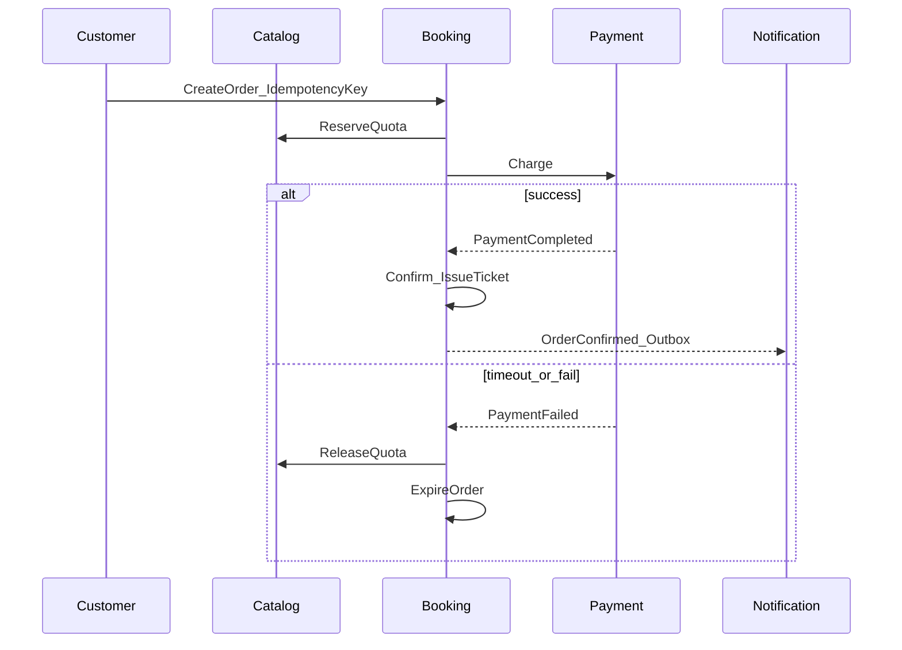
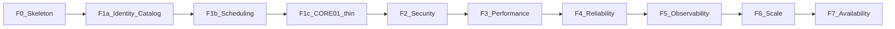

# ReserveFlow — Use Case Catalog

Use cases are **not a product backlog**; they are a list of architectural laboratory experiments.

**Inclusion rule:** A new use case is added only if (1) it exercises a bounded context boundary or aggregate rule and (2) it validates an NFR in `docs/NFR.md` — the same scope guardrail defined in `docs/PROJECT.md`.

In the Application layer, each use case ≈ one command/query handler (e.g., `CreateReservation`). This catalog is the source of truth for folder and handler naming.

Related documents: [PROJECT.md](PROJECT.md) · [DOMAIN.md](DOMAIN.md) · [NFR.md](NFR.md) · [STRUCTURE.md](STRUCTURE.md)

---

## Actors

| Actor | Role |
|-------|-----|
| Customer | Purchases tickets and books appointments |
| Organizer | Manages Events / TicketTypes |
| Provider | Manages availability and appointments |
| Admin | Lists + occupancy reports |
| System | Expiration, outbox, retry (background) |

---

## Template

Each use case is defined by the following fields:

| Field | Description |
|------|----------|
| **ID** | Unique identifier (`UC-*`) |
| **Actor** | Triggering role |
| **Summary** | One sentence |
| **Main Flow** | 3–7 steps |
| **Domain** | Rules / domain events |
| **NFR** | Target NFR IDs |
| **Phase** | F1–F7 |

---

## Critical Vertical Slices (Implement These First)

The laboratory's core scenarios — cross-context flows rather than isolated CRUD operations.

### UC-CORE-01 — Event Ticket Sale (Happy Path)

| Field | Value |
|------|-------|
| **Actor** | Customer |
| **Summary** | An order is placed for a published Event + TicketType; once payment succeeds, a ticket is issued and a notification is queued. |
| **Main Flow** | 1. Customer selects a published Event and an active TicketType. 2. `Order` + `Reservation` are created (`IdempotencyKey`). 3. Quota is reserved in Catalog (`SoldCount++` or hold). 4. Fake payment succeeds. 5. Order becomes `Confirmed` → `Ticket` is issued. 6. `OrderConfirmed` / `TicketIssued` are written to the outbox. |
| **Domain** | Catalog ↔ Booking ↔ Payment ↔ Notification boundaries; events: `OrderCreated`, `PaymentCompleted`, `OrderConfirmed`, `TicketIssued`. |
| **NFR** | NFR-M02, NFR-R02, NFR-R04, NFR-O02 |
| **Phase** | F1 (domain), F4 (idempotency/outbox), F5 (trace) |

### UC-CORE-02 — Appointment Booking (Happy Path)

| Field | Value |
|------|-------|
| **Actor** | Customer |
| **Summary** | An appointment is booked from a Provider's available slot; the Appointment is confirmed after payment. |
| **Main Flow** | 1. Customer selects a Provider and an available slot. 2. An `Appointment` (Pending) is created in Scheduling + an Order/Reservation in Booking. 3. Fake payment succeeds. 4. Appointment becomes `Confirmed`; notification is written to the outbox. |
| **Domain** | Scheduling overlap rule; Booking orchestration; events: `AppointmentBooked`, `OrderConfirmed`. |
| **NFR** | NFR-R01, NFR-P01, NFR-R04 |
| **Phase** | F1, F3 (slot listing), F4 |

### UC-CORE-03 — Double-Selling / Overlap Race

| Field | Value |
|------|-------|
| **Actor** | Customer (concurrent) |
| **Summary** | Two concurrent requests target the same TicketType capacity or TimeSlot; only one succeeds. |
| **Main Flow** | 1. Two requests attempt to create an Order/Appointment simultaneously. 2. Optimistic concurrency or a unique constraint rejects one. 3. The losing request receives a meaningful error; the quota/slot remains consistent. |
| **Domain** | Aggregate consistency; `SoldCount <= Quota`; no Provider overlap. |
| **NFR** | NFR-R01 |
| **Phase** | F4 |

### UC-CORE-04 — Idempotent Retry

| Field | Value |
|------|-------|
| **Actor** | Customer / client retry |
| **Summary** | Repeating an Order or Payment with the same `IdempotencyKey` returns the same result without side effects. |
| **Main Flow** | 1. The first request creates an Order. 2. A second request arrives with the same key. 3. The existing Order/Payment is returned; there is no additional quota decrement or second charge. |
| **Domain** | `Order.IdempotencyKey`, `Payment.IdempotencyKey` are unique. |
| **NFR** | NFR-R02 |
| **Phase** | F4 |

### UC-CORE-05 — Payment Timeout / Failure → Expiration → Quota/Slot Release

| Field | Value |
|------|-------|
| **Actor** | System (+ Customer-triggered payment) |
| **Summary** | After a fake gateway failure or timeout, the Order expires and the Catalog quota or Scheduling slot is released. |
| **Main Flow** | 1. Payment fails/times out. 2. `PaymentFailed` → Booking Order becomes `Expired`/`Cancelled`. 3. Catalog SoldCount is rolled back or the Scheduling slot becomes Available. 4. An outbox notification is created if needed. |
| **Domain** | Event chain / simple saga: `PaymentFailed`, `OrderExpired`; consumers: Catalog, Scheduling. |
| **NFR** | NFR-R03, NFR-R05, NFR-R04 |
| **Phase** | F4 |

---

## Identity

### UC-ID-01 — Registration (Customer)

| Field | Value |
|------|-------|
| **Actor** | Customer (anonymous) |
| **Summary** | User registration with email + password. |
| **Main Flow** | 1. The registration request is validated. 2. Email uniqueness is checked. 3. The password is hashed; User is `Active` + role is `Customer`. |
| **Domain** | Email VO; no plaintext passwords. |
| **NFR** | NFR-S01, NFR-S04, NFR-S05 |
| **Phase** | F2 |

### UC-ID-02 — Login → JWT

| Field | Value |
|------|-------|
| **Actor** | Customer / Organizer / Provider / Admin |
| **Summary** | A JWT access token is issued after authentication. |
| **Main Flow** | 1. Email/password are verified. 2. A Suspended user is rejected. 3. JWT (lifetime ≤ 60 min) + role claims are issued. |
| **Domain** | User status; Role claims. |
| **NFR** | NFR-S01 |
| **Phase** | F2 |

### UC-ID-03 — Role-Based Endpoint Access (RBAC)

| Field | Value |
|------|-------|
| **Actor** | Organizer, Customer, Admin |
| **Summary** | An Organizer can create an Event; a Customer cannot view another customer's order. |
| **Main Flow** | 1. The protected endpoint requires a JWT. 2. Policy/role is checked. 3. Unauthorized → 403; another user's resource → 403. |
| **Domain** | Identity claims → application DTO (ACL). |
| **NFR** | NFR-S02 |
| **Phase** | F2 |

### UC-ID-04 — Rate Limit Exceeded → 429

| Field | Value |
|------|-------|
| **Actor** | Anonymous / Customer |
| **Summary** | Returns 429 when the public endpoint limit of 100 req/min/IP or booking limit of 10 req/min/user is exceeded. |
| **Main Flow** | 1. Within the limit, requests return normal 2xx/4xx responses. 2. Limit exceeded → 429. |
| **Domain** | — (infrastructure middleware). |
| **NFR** | NFR-S03 |
| **Phase** | F2 |

---

## Catalog

### UC-CAT-01 — Create Organizer Profile

| Field | Value |
|------|-------|
| **Actor** | Organizer |
| **Summary** | An identified user creates an OrganizerProfile. |
| **Main Flow** | 1. Authenticated User. 2. DisplayName (+ optional Bio). 3. Persist the `OrganizerProfile` aggregate. |
| **Domain** | UserId references Identity (ID only). |
| **NFR** | NFR-M01, NFR-M02 |
| **Phase** | F1 |

### UC-CAT-02 — Create Event (Draft) + Add TicketType

| Field | Value |
|------|-------|
| **Actor** | Organizer |
| **Summary** | A Draft Event with at least one TicketType (price, quota, sales window). |
| **Main Flow** | 1. Venue + title + StartAt/EndAt. 2. Status is `Draft`. 3. Add TicketType (Quota, Price, SalesStart/End). |
| **Domain** | StartAt < EndAt; TicketType is within the Event aggregate. |
| **NFR** | NFR-M02, NFR-S04 |
| **Phase** | F1 |

### UC-CAT-03 — Publish Event

| Field | Value |
|------|-------|
| **Actor** | Organizer |
| **Summary** | Publishes a Draft Event and opens it for sale. |
| **Main Flow** | 1. Verify at least 1 active TicketType. 2. Reject dates in the past. 3. Status becomes `Published`; `EventPublished`. |
| **Domain** | Only Draft Events can be edited; publishing rules. |
| **NFR** | NFR-M02 |
| **Phase** | F1 |

### UC-CAT-04 — List Events (Pagination + Cache)

| Field | Value |
|------|-------|
| **Actor** | Customer / anonymous (depending on policy) |
| **Summary** | List of published Events with pagination and Redis cache. |
| **Main Flow** | 1. Query using page/pageSize. 2. Cache hit/miss. 3. Respond below the p95 target. |
| **Domain** | Read model; Published filter. |
| **NFR** | NFR-P01, NFR-P02, NFR-P03 |
| **Phase** | F3 |

### UC-CAT-05 — Cancel Event

| Field | Value |
|------|-------|
| **Actor** | Organizer |
| **Summary** | The Event is cancelled; related pending reservations enter the cancellation flow. |
| **Main Flow** | 1. Event becomes `Cancelled`; `EventCancelled`. 2. Booking cancels/expires pending Orders/Reservations. 3. Notification outbox (optional). |
| **Domain** | Cross-context event; quota/slot release. |
| **NFR** | NFR-R04, NFR-O04 |
| **Phase** | F4 |

---

## Scheduling

### UC-SCH-01 — Provider Profile + Weekly Availability

| Field | Value |
|------|-------|
| **Actor** | Provider |
| **Summary** | Defines a Provider profile and WeeklyAvailability. |
| **Main Flow** | 1. DisplayName, Specialty, DefaultDurationMinutes. 2. Day/time ranges. 3. Status is `Active`. |
| **Domain** | Provider aggregate; WeeklyAvailability entity. |
| **NFR** | NFR-M02 |
| **Phase** | F1 |

### UC-SCH-02 — List Available Slots

| Field | Value |
|------|-------|
| **Actor** | Customer |
| **Summary** | Lists Available TimeSlots for a Provider. |
| **Main Flow** | 1. ProviderId + date range. 2. Generate/read slots from Availability. 3. Return all except Booked/Blocked slots. |
| **Domain** | TimeSlot status. |
| **NFR** | NFR-P01, NFR-P02 |
| **Phase** | F3 |

### UC-SCH-03 — Create Appointment (Overlap Prevention)

| Field | Value |
|------|-------|
| **Actor** | Customer |
| **Summary** | Creates an Appointment for the selected slot; overlap for the same Provider is prohibited. |
| **Main Flow** | 1. Check whether the slot is Available. 2. Appointment is Pending. 3. Reject if an overlap exists. |
| **Domain** | Overlap rule; `AppointmentBooked`. |
| **NFR** | NFR-R01, NFR-M02 |
| **Phase** | F1, F4 |

### UC-SCH-04 — Cancellation / Rescheduling

| Field | Value |
|------|-------|
| **Actor** | Customer / Provider |
| **Summary** | Cancellation subject to the 24-hour rule; simple rescheduling. |
| **Main Flow** | 1. Cancellation request → 24-hour policy. 2. Status becomes `Cancelled`; slot is released. 3. Rescheduling: cancel the previous appointment + select a new slot (simple). |
| **Domain** | Cancellation policy VO; `AppointmentCancelled`. |
| **NFR** | NFR-M02, NFR-R01 |
| **Phase** | F1 |

---

## Booking + Payment + Notification

CORE-01…05 form the backbone; the following use cases are complementary.

### UC-BOOK-06 — Expire Pending Reservation (System)

| Field | Value |
|------|-------|
| **Actor** | System |
| **Summary** | A Pending Reservation/Order whose `ExpiresAt` has passed expires automatically. |
| **Main Flow** | 1. A background job scans candidates. 2. Status becomes `Expired`; `OrderExpired`. 3. Catalog/Scheduling releases the resource. |
| **Domain** | Reservation ExpiresAt; event consumers. |
| **NFR** | NFR-R03 |
| **Phase** | F4 |

### UC-PAY-01 — Fake Gateway Scenarios

| Field | Value |
|------|-------|
| **Actor** | Customer (via Payment) |
| **Summary** | `IPaymentGateway` fake adapter: success / failure / timeout. |
| **Main Flow** | 1. Charge call. 2. Completed / Failed / timeout based on the configured scenario. 3. Booking reacts through an event (CORE-01 or CORE-05). |
| **Domain** | ACL: port/adapter; `PaymentCompleted` / `PaymentFailed`. |
| **NFR** | NFR-R05, NFR-SC03 (future) |
| **Phase** | F4 |

### UC-NOTIF-01 — Outbox Delivery and Retry

| Field | Value |
|------|-------|
| **Actor** | System |
| **Summary** | OutboxMessage Pending → Processing → Sent; retry on failure. |
| **Main Flow** | 1. A domain event creates an outbox row. 2. Worker processes it → LoggingNotificationSender. 3. Failure → RetryCount++, NextRetryAt. |
| **Domain** | OutboxMessage aggregate; NotificationLog. |
| **NFR** | NFR-R04 |
| **Phase** | F4 |

---

## Admin

### UC-ADM-01 — List Events / Appointments

| Field | Value |
|------|-------|
| **Actor** | Admin |
| **Summary** | Event and Appointment lists for the Admin panel. |
| **Main Flow** | 1. JWT + Admin role. 2. Filtered/paginated list. |
| **Domain** | Cross-context read (ID + DTO); no writes. |
| **NFR** | NFR-S02, NFR-P02 |
| **Phase** | F2, F3 |

### UC-ADM-02 — Sales Count + Occupancy Rate

| Field | Value |
|------|-------|
| **Actor** | Admin |
| **Summary** | Simple report: sales count and occupancy. |
| **Main Flow** | 1. Aggregate query for an Event/TicketType or Provider. 2. SoldCount/Quota or booked/available ratio. |
| **Domain** | Read-only projection; no complex BI. |
| **NFR** | NFR-P01, NFR-A02 (read path alongside health checks) |
| **Phase** | F3, F7 |

---

## Implementation Order (Stages)

The order is fixed by dependency: first the domain skeleton and a single vertical slice (event ticket), followed by security, performance, reliability, and observability.

### F0 — Solution Skeleton (No Use Cases)

| Order | Task | Output / Evidence |
|------|-----|----------------|
| 0.1 | 4 layers + `Shared` (Entity, AggregateRoot, VO, IDomainEvent) | Compiling solution |
| 0.2 | EF Core + PostgreSQL DbContext (empty/minimal) | Migration runs |
| 0.3 | NetArchTest layer rules | NFR-M01 |

**Completion gate:** Architecture test passes; no Infrastructure → Domain dependency.

---

### F1a — Identity + Catalog (Write Path)

| Order | Use Case | Note |
|------|----------|-----|
| 1 | **UC-ID-01** Registration | JWT not required; User aggregate + hash |
| 2 | **UC-ID-02** Login (simple token or dev stub) | Full JWT hardening in F2 |
| 3 | **UC-CAT-01** Organizer profile | UserId reference |
| 4 | **UC-CAT-02** Event Draft + TicketType | Includes Venue |
| 5 | **UC-CAT-03** Publish | Domain rules + unit test |

**Completion gate:** An Organizer can produce a published Event; NFR-M02 domain tests.

---

### F1b — Scheduling (Write Path)

| Order | Use Case | Note |
|------|----------|-----|
| 6 | **UC-SCH-01** Provider + weekly availability | |
| 7 | **UC-SCH-03** Create Appointment (overlap) | Domain + unit; thin API |
| 8 | **UC-SCH-04** Cancellation / rescheduling | 24-hour policy |

**Completion gate:** Overlap rejection is proven by a unit test.

---

### F1c — First Vertical Slice (Thin UC-CORE-01)

The happy path is synchronous and simple: no outbox/concurrency; fake payment supports **success** only.

| Order | Use Case | Note |
|------|----------|-----|
| 9 | Create Order + Reservation (CORE-01 steps 1–3) | Quota hold/SoldCount |
| 10 | **UC-PAY-01** success only | Port + FakePaymentGateway |
| 11 | Confirm + issue Ticket (CORE-01 step 5) | `TicketIssued` domain event (in-process) |
| 12 | **UC-CORE-02** thin slice | SCH-03 + same Order/Payment path |

**Completion gate:** Event ticket and appointment flows work end-to-end (success only); F1 is complete.

---

### F2 — Security

Lock down existing endpoints; no new business rules.

| Order | Use Case | Note |
|------|----------|-----|
| 13 | **UC-ID-02** JWT Bearer (≤ 60 min) | NFR-S01 |
| 14 | **UC-ID-03** RBAC | Organizer creation; Customer isolation |
| 15 | FluentValidation on all public commands | NFR-S04 |
| 16 | **UC-ID-04** Rate limit | public + booking |
| 17 | **UC-ADM-01** listing (with RBAC) | Admin only |

**Completion gate:** 401 / 403 / 429 integration tests pass.

---

### F3 — Performance (Read Paths)

| Order | Use Case | Note |
|------|----------|-----|
| 18 | **UC-CAT-04** List Events | pagination + Redis + index |
| 19 | **UC-SCH-02** List available slots | p95 measurement |
| 20 | **UC-ADM-02** occupancy report | simple aggregate query |

**Completion gate:** Evidence of p95 < 300 ms for listing endpoints (NFR-P01/P02/P03).

---

### F4 — Reliability (Core Hardening)

| Order | Use Case | Note |
|------|----------|-----|
| 21 | **UC-CORE-04** Idempotency | Order + Payment key |
| 22 | **UC-CORE-03** Double-selling / overlap race | concurrency test |
| 23 | **UC-PAY-01** fail + timeout | |
| 24 | **UC-CORE-05** expiration + quota/slot release | event chain |
| 25 | **UC-BOOK-06** System expiration job | |
| 26 | **UC-NOTIF-01** Outbox + retry | LoggingNotificationSender |
| 27 | **UC-CAT-05** Event cancellation → pending cancellation | |

**Completion gate:** Test evidence for NFR-R01…R05; zero double-booking.

---

### F5 — Observability

No new use cases; instrumentation through **UC-CORE-01**.

| Order | Task | Evidence |
|------|-----|-------|
| 28 | Structured logging + correlation | NFR-O01 |
| 29 | OTel trace (Booking → Payment → Outbox spans) | NFR-O02 |
| 30 | Latency / error / throughput metrics | NFR-O03 |

**Completion gate:** Booking flow dashboard in Grafana/Prometheus.

---

### F6 — Scalability

| Order | Task | Evidence |
|------|-----|-------|
| 31 | k6: **UC-CORE-01** happy path | NFR-SC02 |
| 32 | k6: **UC-CORE-03** race scenario | NFR-R01 under load |
| 33 | Horizontal scale + circuit breaker (fake gateway) | NFR-SC01/SC03 |

**Completion gate:** Load test report under `docs/` or `artifacts/`.

---

### F7 — Availability

| Order | Task | Evidence |
|------|-----|-------|
| 34 | Health checks (db, redis, self) | NFR-A02 |
| 35 | Backup / restore drill + runbook | NFR-A03 |
| 36 | Smoke-test UC-ADM reads with health checks | NFR-A01 target |

**Completion gate:** Runbook + restore evidence; [PROJECT.md success criteria](PROJECT.md#success-criteria).

---

## Phase Summary (At a Glance)

| Phase | Focus | Use Case Order | Evidence |
|-----|------|-----------------|-------|
| F0 | Skeleton | — | NetArchTest |
| F1a | Identity + Catalog | ID-01 → ID-02 → CAT-01 → CAT-02 → CAT-03 | Domain unit |
| F1b | Scheduling | SCH-01 → SCH-03 → SCH-04 | Overlap unit |
| F1c | Vertical slice | CORE-01 thin → PAY success → CORE-02 thin | E2E success |
| F2 | Security | ID-02 JWT → ID-03 → validation → ID-04 → ADM-01 | 401/403/429 |
| F3 | Performance | CAT-04 → SCH-02 → ADM-02 | p95 / cache |
| F4 | Reliability | CORE-04 → CORE-03 → PAY fail → CORE-05 → BOOK-06 → NOTIF-01 → CAT-05 | R01–R05 |
| F5 | Observability | CORE-01 instrumentation | OTel dashboard |
| F6 | Scale | CORE-01/03 k6 | Load report |
| F7 | Availability | health + backup | Runbook |

---

## Deliberately Excluded Use Cases

The following are outside the Phase 1 MVP; they would introduce feature bloat into the laboratory without producing NFR evidence:

- Seat map
- Real PSP (Stripe, Iyzico, etc.)
- Complex pricing / promotion engine
- Multi-tenant (SaaS)
- Waitlist
- Mobile application
- Multiple currencies
- Real SMS/email provider
- Live queue display via WebSocket

Details: [PROJECT.md — Outside the MVP](PROJECT.md#out-of-mvp-scope-do-not-implement-in-phase-1).

---

## Application Handler Mapping (Target Names)

| Use Case ID | Handler / Folder (Example) |
|-------------|--------------------------|
| UC-ID-01 | `Users.RegisterUser` |
| UC-ID-02 | `Users.LoginUser` |
| UC-CAT-01 | `Catalog.CreateOrganizerProfile` |
| UC-CAT-02 | `Catalog.CreateEvent`, `Catalog.AddTicketType` |
| UC-CAT-03 | `Catalog.PublishEvent` |
| UC-CAT-04 | `Catalog.ListEvents` |
| UC-CAT-05 | `Catalog.CancelEvent` |
| UC-SCH-01 | `Scheduling.CreateProvider`, `Scheduling.SetWeeklyAvailability` |
| UC-SCH-02 | `Scheduling.ListAvailableSlots` |
| UC-SCH-03 | `Scheduling.BookAppointment` |
| UC-SCH-04 | `Scheduling.CancelAppointment`, `Scheduling.RescheduleAppointment` |
| UC-CORE-01 | `Bookings.CreateOrder`, `Payments.ProcessPayment`, `Bookings.ConfirmOrder` |
| UC-CORE-02 | `Scheduling.BookAppointment` + booking/payment chain |
| UC-CORE-04 | same CreateOrder/ProcessPayment (idempotency) |
| UC-BOOK-06 | `Bookings.ExpireReservations` (hosted service) |
| UC-NOTIF-01 | `Notifications.ProcessOutbox` |
| UC-ADM-01 | `Admin.ListEvents`, `Admin.ListAppointments` |
| UC-ADM-02 | `Admin.GetOccupancyReport` |
